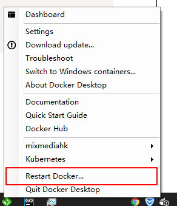
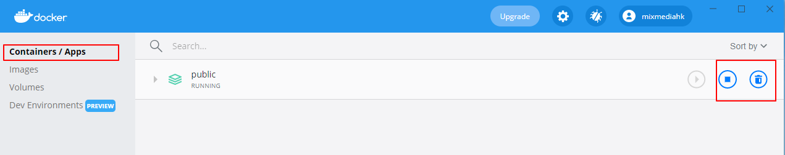

# MM Project Launcher

基于 `docker` 容器的 windows 10 开发环境

### How to use

1. 下载 zip 文件，解压 exe 到项目 `public` 目录下
2. 执行 exe 文件，根据提示进行操作
3. 等候 exe 执行完毕后，重新刷新打开的网页，就会见到已经跑起来的网站了。

### 常见问题

1. 工具提示 `install docker desktop first plz`, 请先安装 [docker desktop](https://docs.docker.com/docker-for-windows/install/)
2. 工具提示 `start docker desktop first plz`, 没有启动 `docker` 引擎, 找到已经安装的 `Docker Desktop` 并启动。
如果还未有问题，请重启引擎 

3. 如果关闭正在运行的 `docker` 项目, 打开 docker desktop, 找到 `Containers / Apps`， 找到对应的项目干掉。
